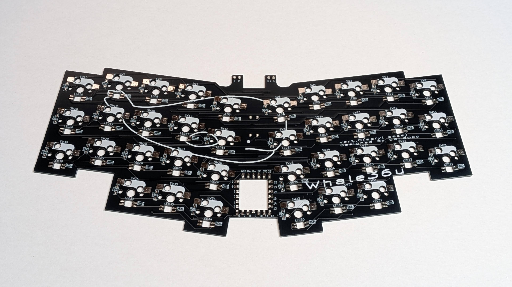
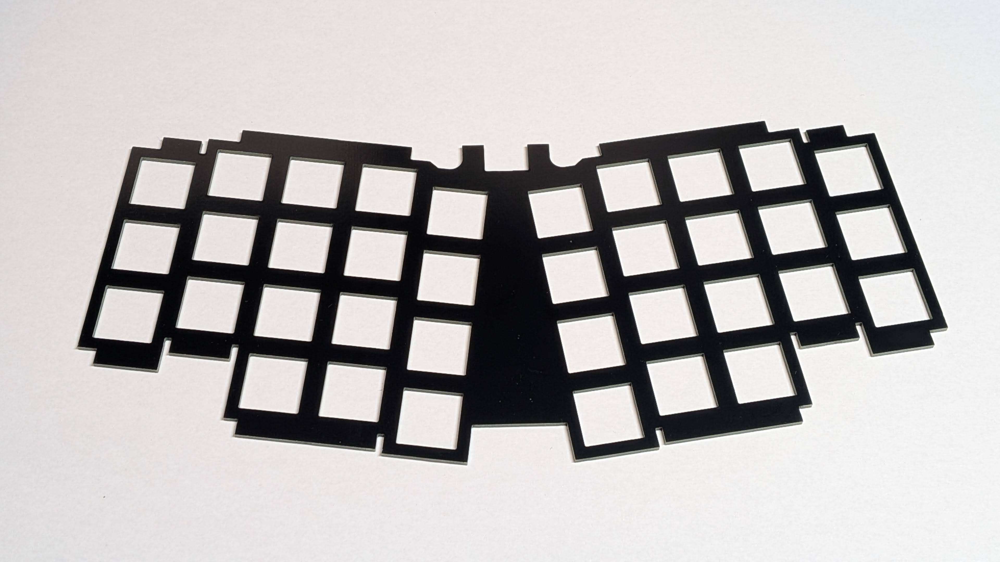
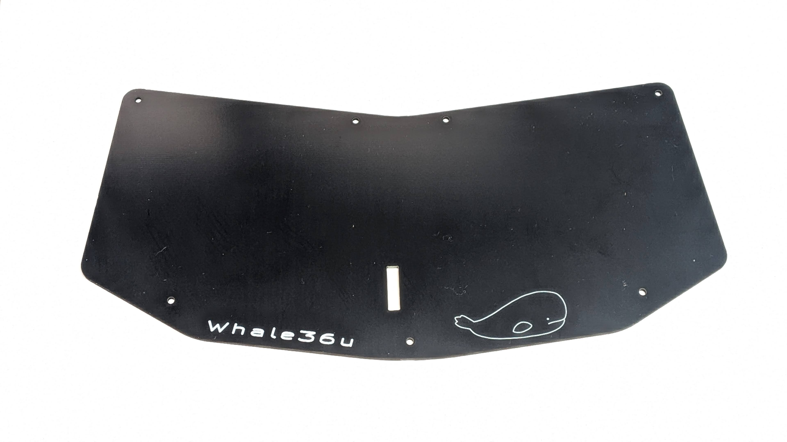
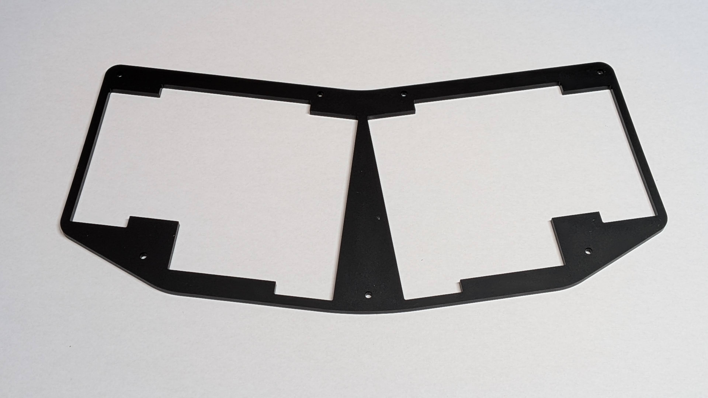
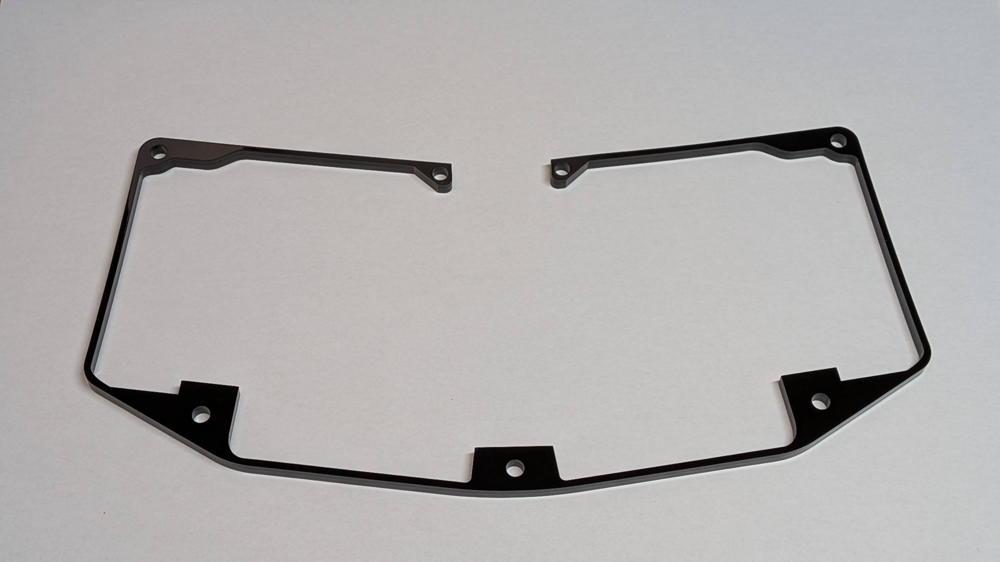
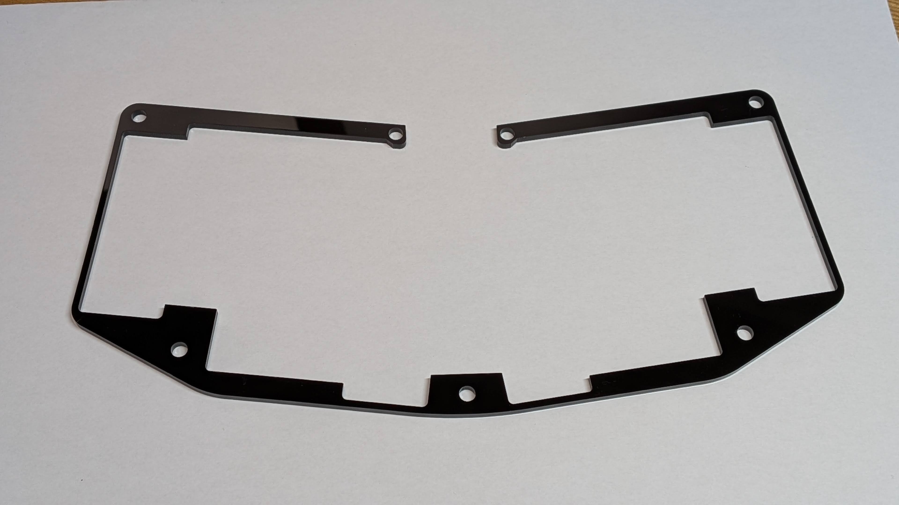
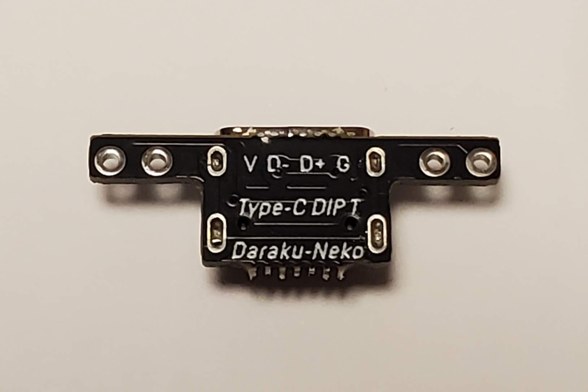
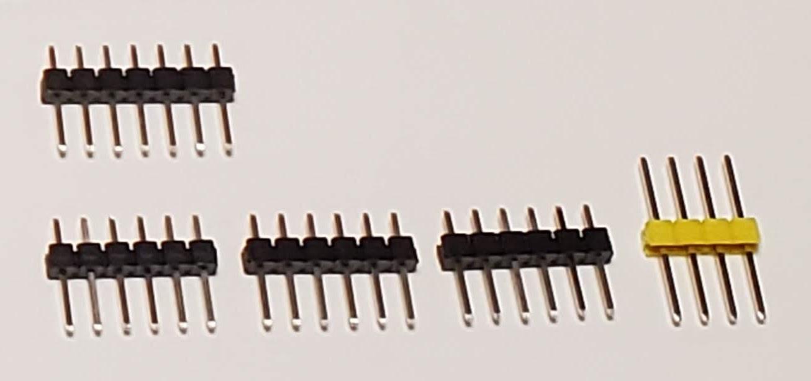
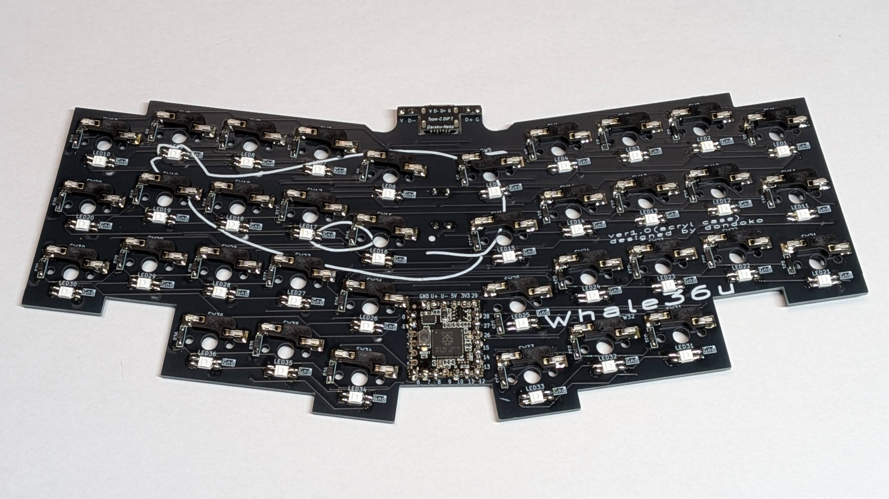
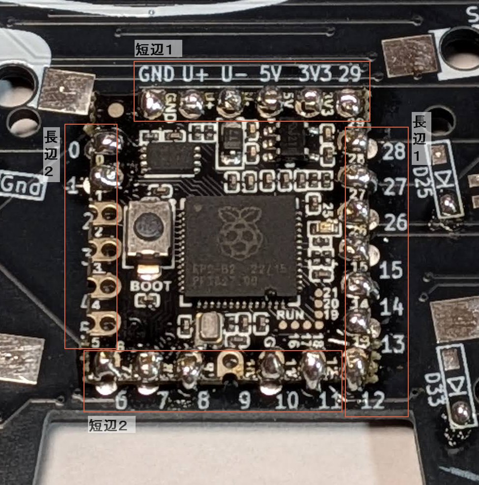

# Whale36u　ビルドガイド

## 同梱品まとめ
|パーツ名|個数|素材など|
|:---|---:|:---|
|PCB基板|1枚|FR-4|
|スイッチプレート|1枚|FR-4|
|ボトムプレート|1枚|FR-4|
|トッププレート|1枚|アクリル(マットブラック色またはマットホワイト色いずれか1枚)|
|ミドルプレートA|1枚|アクリル、上側|
|ミドルプレートB|3枚|アクリル、下側|
|RP2040-Core-A|1個|(以下マイコンと呼称)|
|USB Type-Cコネクタ DIP化基板|1個|(以下USB基板と呼称)|
|ピンヘッダ|1セット||
|ゴム足|?個||

- PCB基板

- スイッチプレート

- ボトムプレート

- アクリルプレート・トップ

- アクリルプレート・ミドルA

- アクリルプレート・ミドルB

- RP2040-Core-A

- USB Type-Cコネクタ DIP化基板

- ピンヘッダ 1セット(写真のほかに、USB基板付属の4ピンのもの1セット)

- ゴム足　?個

## その他必要なパーツ

|パーツ名|備考|個数|
|:---|:---|---:|
|MXスイッチ用Kailh PCBソケット||36|
|1N4148 ダイオード(SMDタイプ)||36|
|M2ネジ|3mm|7|
|M2ネジ|5mm|7|
|M2スペーサー|12mm|7|
|CherryMX互換キースイッチ||36|
|CherryMX互換キーキャップ||36|

# 作製手順

完成形(PCB基板裏面。ボトムプレートを外したところ)

## 最初に
以下、PCB基板の「Whale36」の表記のある側を「裏面」、反対側を「表面」と呼称します。

## 基板のフチの色塗り

ボトムプレートの「ふち」は、切断面が白っぽく、見映えがあまり良くないので黒のマーカーで塗ることをおすすめします。

PCB基板、スイッチプレートはアクリルケースの中に入って見えないので、塗る必要はないです。

## マイコンのはんだ付け
PCB基板にマイコンをはんだ付けします。

### 短辺のはんだ付け
マイコンは、ピンヘッダを使ってはんだ付けします。ピンヘッダは6ピンのものを3セット使いますので、長い物は適当にカットして下さい。

基板の裏面を上に向けて置きます。

マイコンのBOOTスイッチのある面を上にして、短いほうの2辺に、ピン数6のピンヘッダを、ピンの「長い側」から差し込み、マスキングテープなどで基板に仮止めします。

ピンヘッダを差し込むピンは、6番から11番までの6つと、GNDから29番までの6つです。

基板を返して表面を上に向け、9番ピンを除く全てのピンをはんだ付けします(9番はハンダ付けしません)。

はんだ付け前あるいははんだ付け後に、ピンの頭をニッパでカットします。

※ このとき、ニッパがマイコン上の部品に触れて壊すことのないよう、十分気をつけて下さい。BOOTボタンはとくに脆いと思いますので注意して下さい。

次に基板を裏返します(裏面)。ピンに付いている、プラスチックのパーツを、マイコン上の部品に触れないよう気をつけながら引き抜きます(このパーツを取り除かないと、マイコンの高さが高すぎて、組立時にボトムプレートと干渉します)。あるいは、引き抜かなくても、隙間にニッパを入れてピンを切れるようでしたら、先に切ってしまっても差し支えないと思います。くれぐれもマイコン上のパーツを壊さないよう注意して下さい。

ピンをはんだ付けし、余ったピンの頭をカットします(先にカットしてからはんだ付けでも大丈夫です)。

### 長辺のはんだ付け

今度は基板の裏面から、長いほうの2辺のうち、12,13,14,15,26,27,28のピンに、ピン数7のピンヘッダを、また0,1のピンにピン数2のピンヘッダ(6ピンのものを切り取って使います)を差し込み、マスキングテープなどで基板に仮止めします。

基板を返して表面を上に向け、ピンをはんだ付けします(2,3,4,5番のピンはハンダ付けしません)。

※ 十分短く切ってしまってもはんだ付けできると思いますが、私は少し心配だったので、わずかに(1mm弱)頭が残るようにカットしました。

あとは短辺のときと同様に、基板の裏面から、ピンヘッダのプラスティックの部品を外し、この面もはんだ付けし、余ったピンの頭をカットします。

## USB基板のはんだ付け
(USB基板の上下に、面付けされていた際のミシン目のバリが残っています。そのまま使用しても動作に影響はありませんが、見た目が気になる方は、ヤスリなどで整えてお使い下さい。)

USB基板は、2ピンのピンヘッダ2個を使って、マイコンと同じように、基板にはんだ付けします。

仮止め後、表面からハンダ付けし、裏返してピンヘッダのプラスチック部品を取り外し、はんだ付けします。ピンヘッダの頭はなるべく低くなるようカットします。(マイコンの長辺の時ほど高さにシビアになる必要はありません)

※ PCB基板上の「V D- D+ G」の表記と、USB基板上の同様の文字の向きが一致するように配置します。USB端子の載っている面が表側(上側)になります。

## ファームウェアの書き込み
PCと接続して、ファームウェアを書き込みし、動作の確認をします。

[このページ](firmware/readme.md)からファームウェアをダウンロードします(.uf2ファイル)。

マイコン上のBOOTボタンを押しながら、USB-C端子でPCと接続すると、キーボードがドライブとして認識されます。このドライブのルートフォルダに、ダウンロードしたファイルをドラッグ&ドロップすると、書き込みが行われ、自動的にキーボードのマイコンが再起動され、今度はキーボードとして認識されます。

もし、PCに接続しても認識がされない場合、はんだ付けが正しくされていないピンがあるかもしれません。全てのピンがピンヘッダを通じて基板にはんだ付けされていることを確認して下さい。  

この段階ではまだ文字入力は行えません。キーボードが認識され、ファームウェアの書き込みができれば十分です。詳細には、Vialアプリを起動またはVialのウェブサイトを開いて、正しくキーボードが認識されているのを確かめることもできます。

マイコンの挙動が確認できましたので、次のステップに進んで下さい。

## ダイオードとスイッチソケットのはんだ付け
ダイオードとスイッチソケット各30個をはんだ付けします。ダイオードは取付向きがあるので注意して下さい。基板上のフットプリントの「短い線」と、ダイオード部品に書かれた縦線のある側を合わせるようにはんだ付けします。

## 入力動作の確認
キースイッチを取り付ける前に、すべての部品が正しくはんだ付けされているかを確認するために、Vialを起動して、MatrixTesterをクリックし、下部のボタン'unlock'を押します。アンロックするためには、左下の2つのボタンを同時に押す必要があるので、この二つのスイッチだけ基板のソケットに差し込みんで、ロックが解除になるまでボタンを同時押しします。

基板の裏側から各ソケットの2つの端子をピンセットなどで短絡すると、キーを押下したことになります。全てのキーを順番に短絡していって、MatrixTesterの全てのキーを反転させることが出来たら、テストは成功です。

## キースイッチの仮取り付け
四隅のキースイッチをまずは仮組みのために取り付けます。スイッチプレート四隅のスイッチ穴にキースイッチを差し、PCB基板にスイッチを差し込みます。これでスイッチプレートと基板が固定されました。

## ポロン・ガスケットの貼り付け
スイッチプレートの縁の図の場所に、ポロンシートを適当な幅に切って両面テープで貼り付けます。ポロンシートはスイッチプレートの両面に貼って、
上下かトッププレートと、ミドルプレートBに挟まれるように配置します。使用するポロンシートの分量(長さ)によって、ガスケットの効果の強弱が変わります。
お好みの硬さになるように分量を調節してください。

## プレートの組み立て ～ 最終仕上げまで
トッププレートとボトムプレートには、7箇所のネジ穴があります。

ボトムプレートの裏側(「Whale36」と書かれた側)からM2ネジを差し込んで、7個のM2スペーサーを固定します。

ボトムプレート上のスペーサーを、3枚のミドルプレートBのスペーサー穴に通します。

ミドルプレートBの上に重なるように、ミドルプレートAを通します。

ポロンシートを貼り付けたスイッチプレート(とPCB基板が一体のもの)を、ミドルプレートBの縁に載せるように配置します。

トッププレートを載せて、スペーサーにM2ネジで固定します。

スイッチプレートに前後左右する多少の余裕があると思いますので、(キーキャップ取り付け後に)前後左右させて、
キーとトッププレートが干渉しないように調整します。

残っているスイッチをスイッチプレート・PCB基板に差し込みます。

ボトムプレートの四隅に、ゴム足を貼り付けます。

これで完成です。作業お疲れ様でした。
